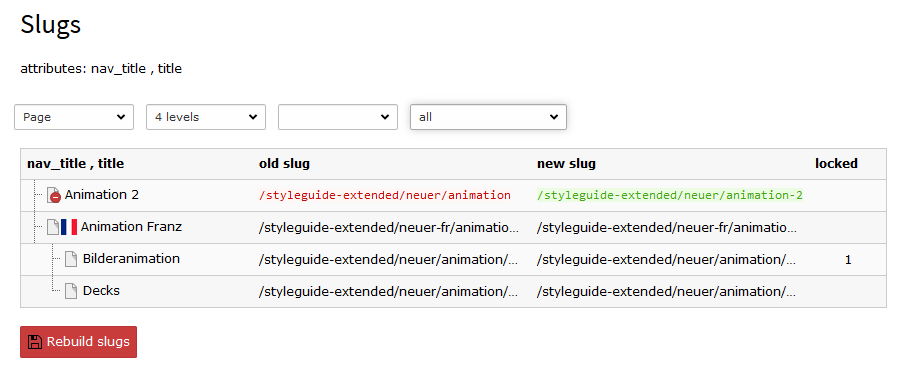

.. ==================================================
.. FOR YOUR INFORMATION
.. --------------------------------------------------
.. -*- coding: utf-8 -*- with BOM.

.. include:: ../Includes.txt

.. _introduction:

Introduction
============

.. _what-it-does:

What does it do?
----------------

Extension to rebuild the slugs of the pages or any other table with slugs like e.g. news.
It also offers an ovierview of the current slugs and shows which slugs would be changed.

The table with slug fields are automaticly detected. Non admin users only have access to tables if they can change the slug field. 

It builds the slugs with the bugfix 87085 (FEATURE 59167: Fallback options for slug fields) in mind (not present in TYPO3 9.5.4), but the extension works in current TYPO3 version.

The extension is still alpha. Workspaces are not implemented.

.. _screenshots:

Screenshots
-----------

   Slugs Overview of a subtree with some translations

