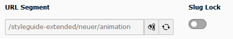

.. ==================================================
.. FOR YOUR INFORMATION
.. --------------------------------------------------
.. -*- coding: utf-8 -*- with BOM.

.. include:: ../Includes.txt

.. _user-manual:

Users Manual
============

The extension has its own entry in the web menu.

If you don't like it you can change it in the extension settings and move it to the info module pulldown.

Users can lock the slug to prevent rebuilding.

The locking is only implemented on pages. On other tables an attribute like slug_locked is needed (e.g. on news the attribute path_segment_locked)